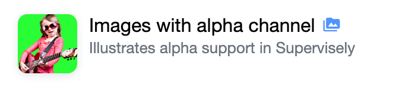

# Create Foreground Mask

  <a href="#Overview">Overview</a> •
  <a href="#How-To-Use">How To Use</a>

# Overview

App adds `foreground` and `fuzzy` classes to the project and then for every image with alpha channel creates two masks: foreground object (pixels with opacity >= threshold) and fuzzy object (semi-transparent pixels - with opacity in range [1, 254]). 

Usage example: foreground objects (blue) can be used during research with synthetic training data, fuzzy objects (gray) are helpful for analyzing quality of alpha channel. 

# How To Use

1. Add app from ecosystem to your team
2. Prepare project with alpha-channel images. Or add [example project](https://ecosystem.supervise.ly/projects/images-with-alpha-channel) from ecosystem.
   

3. Run it from context menu of images project

4. (Optional) change input parameters: threshold and fuzzy flag

5. What until task finished. Masks will be added to existing project on top of existing annotations. If image doesn't have alpha channel, app will print corresponding warning to task log.
